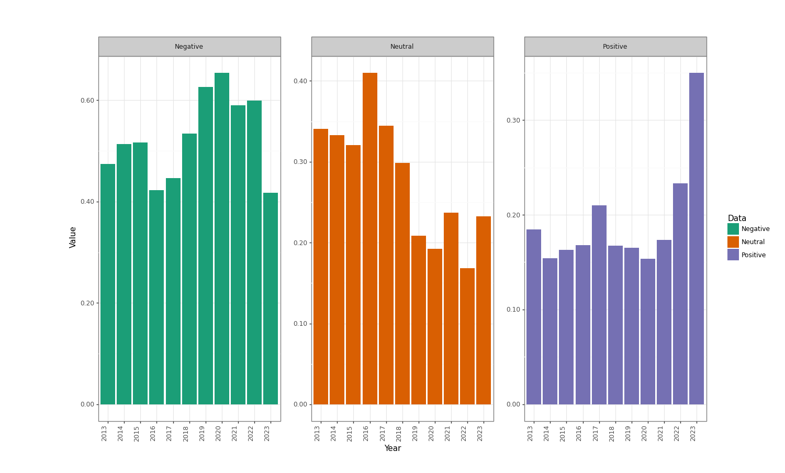

# 推特有关习近平推文的情感态度分析

作者：能动B2104 杨牧天

## 项目架构

```shell
Twitter
│  test.py # 测试脚本
│
├─Crawler # 爬虫文件夹
│      cookies.json # 登录Cookie
│      Crawler.py # 爬虫脚本
│
└─EmotionAnalysis # 情感分析文件夹
        EAClass.py # 情感分析脚本
        result.json
```

## 项目简介

### 项目目的

本项目旨在通过爬取Twitter上与习近平有关的十年间（2013-2023）推文，并对推文内容进行情感态度分析，得到十年间相关数据，用于进行国际传播方面的分析。

### 项目实施方法

1. 通过基于`pyppeteer`的异步爬虫对推特搜索结果进行初步爬取
2. 对推文进行深入爬取，获取推文内容
3. 对推文内容进行情感态度分析并对分析结果进行简单的处理

## 项目过程

### 爬取推特2013-2023年习近平关键词搜索的数据

通过观察推特搜索方式可知：

1. 推特搜索限制使直接搜索仅可获得少量数据且时间范围很小（一般集中在当前时间附近几天）
2. 推特采用Ajax方式异步加载数据，无翻页部分

针对其特点，采用如下方法进行解决优化：

1. 通过设置`params`指定日期：

```python
self.url = "https://twitter.com/search?q={q}%20until%3A{year1}-{month1}-{date1}%20since%3A{" \
                   "year2}-{month2}-{date2}&src=typed_query&f=top "
```

> 其中until表示截止日期，since表示起始日期，q表示搜索文本

2. 爬取时自动滚动，使用报错重试并设置停止条件

```python
while True:
    ... ... ...
    ... ... ...
	position1 = await self.page.evaluate("() => {return window.pageYOffset}")
	await self.page.evaluate(f"window.scrollBy(0, {scroll_y})")
	position2 = await self.page.evaluate("() => {return window.pageYOffset}")

	if position1 == position2:  break
    ... ... ... 
```

> 通过pyppeteer运行JS代码获取当前页面位置1，接着使滚轮滚动，获取当前页面位置2，判断位置1是否等于位置2，若相等则退出循环，**通过这种方法可以控制页面滚动到底部即当前页面数据爬取完毕时退出当前循环。**

```python
from aioretry import retry, RetryPolicyStrategy, RetryInfo
... ... ... 
def _retry_policy(self, info: RetryInfo) -> RetryPolicyStrategy:
    return False, (info.fails - 1) % 3 * 0.1
... ... ... 
... ... ...
@retry("_retry_policy")
async def crawler_main_page(self, q, semaphore, years=(2013, 2023), months=(1, 12), dates=(1, 31)):
    ... ... ...
```

> 在类中使用Python异步重试库`aioretry`，当报错时重新运行指定函数，以此减少错误带来的影响

### 爬取结果

下面为保存在`MongoDB`数据库中的部分数据：


下面为经过深入爬取得到的推文样例：

```json
[
    {"zh": "三个寿辰考验中国 习近平如何做？:... http://goo.gl/JLwLR"}, 
    {"zh": "官方：习近平禁奢令下 中国高档餐厅惨透了:... http://dlvr.it/2zNnQT"}, 
    ... ... ...
]
```

### 情感态度分析

使用`huggingface.co`上提供的推文政治情感态度分析模型`cardiffnlp/xlm-twitter-politics-sentiment`进行情感态度分析。

由于该模型训练语言多为英语，西班牙语，法语，因此使用Python的`translate`模块将非英文推文翻译为英文：

```python
def translate_data(text, target_language):
    translator = Translator(to_lang=target_language)
    translated_text = translator.translate(text)
    return translated_text
```

接着使用模型进行情感态度分析：

```python
MODEL = "cardiffnlp/xlm-twitter-politics-sentiment"
tokenizer = AutoTokenizer.from_pretrained(MODEL)
model = AutoModelForSequenceClassification.from_pretrained(MODEL)
... ... ... 
def get_score(text, language):
    n_text = text if language == "en" else translate_data(text, "en")
    encoded_input = tokenizer(n_text, return_tensors='pt')
    output = model(**encoded_input)
    scores = output[0][0].detach().numpy()
    scores = softmax(scores)
    labels = model.config.id2label
    return [(labels[j], i) for j, i in enumerate(scores)]
```

经过观察发现，我们共收集推文每年约为3万条，数据量较为庞大，且其中含有大量个人用户偏激跟风言论，为了筛选较为合理的言论，我通过简单的排序获取了一年中发帖量大于500条的个人或媒体，选择其中前十名，随机在其推文中抽取50个进行分析，**十年总计5000条数据**，对筛选后的数据进行处理，得到一年中总的情感分布：

```json
[
   {
      "2013": {
         "Negative": 0.4746281669543644,
         "Neutral": 0.34085457681707565,
         "Positive": 0.18451725622855997
      }
   },
   {
      "2014": {
         "Negative": 0.5134993418798754,
         "Neutral": 0.33256274204819025,
         "Positive": 0.15393791607193427
      }
   },
   ... ... ...
   ... ... ...
{
      "2023": {
         "Negative": 0.41776802255617707,
         "Neutral": 0.23253007419945212,
         "Positive": 0.34970190324437084
      }
   }
]
```

**该数据可为国际传播学有关中国国际形象相关研究使用**

## 数据可视化

下面是简单的数据可视化展示

```python
from plotnine import *
import json
import pandas as pd

with open("result.json", "r") as file:
    data = json.load(file)

dict_data = {
    "Positive": [list(i.values())[0]["Positive"] for i in data],
    "Negative": [list(i.values())[0]["Negative"] for i in data],
    "Neutral": [list(i.values())[0]["Neutral"] for i in data],
    "Year": [str(i) for i in range(2013, 2024)],
}
df = pd.DataFrame(dict_data)

df_long = pd.melt(df, id_vars=['Year'], var_name='Data', value_name='Value')

base_plot = ggplot(df_long, aes(x='Year', y='Value', fill='Data')) + \
            geom_bar(stat='identity', position='dodge') + \
            scale_x_discrete(labels=df['Year'].tolist()) + \
            scale_y_continuous(labels=lambda x: [f'{v:.2f}' for v in x]) + \
            theme_bw() + \
            facet_wrap('~ Data', scales='free_y') + \
            scale_fill_manual(values=["#1b9e77", "#d95f02", "#7570b3"]) + \
            theme(panel_spacing=0.25, axis_text_x=element_text(angle=90, hjust=1))

print(base_plot)
```



